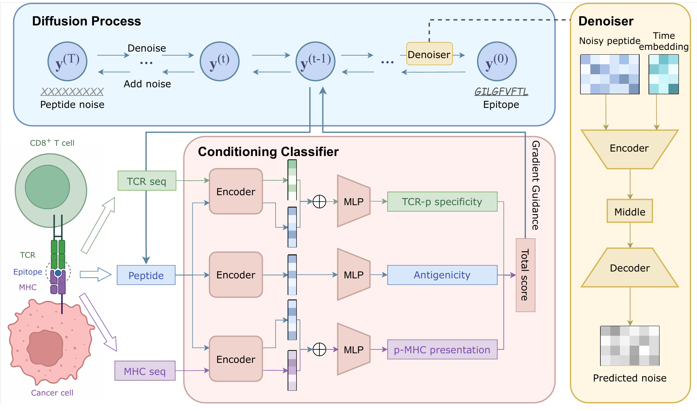

# EPIC: Multi-objective Guided Diffusion for Epitope Design in TCR-pMHC Complexes

This repository is the official implementation of EPIC: Multi-objective Guided Diffusion for Epitope Design in TCR-pMHC Complexes. 


## Requirements

To install requirements:

```setup
conda create -n epic python=3.9.12
conda activate epic

pip install -r requirements.txt
```


## Training

To train the generator of EPIC, run this command:

```train
python train_generator.py
```

To train the classifier of EPIC, run this command:

```train
python train_agpep_pred.py --gpus 0,1  # train the antigenicity classifier
python train_pmhc_pred.py --gpus 0,1  # train the pMHC presentation classifier
python train_speci_pred.py --gpus 0,1  # train the TCR-p specificity classifier
```

## Sampling

To sample, run this command:
```sample
python sample.py --mode uncond         # sampling without gradient guidance
python sample.py --mode cond           # sampling with guidance
python sample.py --mode cond_resample  # sampling with guidance and resampling strategy
```

## Evaluation

To evaluate the generated peptides, run:

```eval
python eval.py
```

## Pre-trained Models

You can download pretrained models here:

- [My awesome model](https://drive.google.com/mymodel.pth) trained on ImageNet using parameters x,y,z. 

>📋  Give a link to where/how the pretrained models can be downloaded and how they were trained (if applicable).  Alternatively you can have an additional column in your results table with a link to the models.

## Results

Our model achieves the following performance on :

### [Image Classification on ImageNet](https://paperswithcode.com/sota/image-classification-on-imagenet)

| Model name         | Top 1 Accuracy  | Top 5 Accuracy |
| ------------------ |---------------- | -------------- |
| My awesome model   |     85%         |      95%       |

>📋  Include a table of results from your paper, and link back to the leaderboard for clarity and context. If your main result is a figure, include that figure and link to the command or notebook to reproduce it. 


## Contributing

>📋  Pick a licence and describe how to contribute to your code repository. 